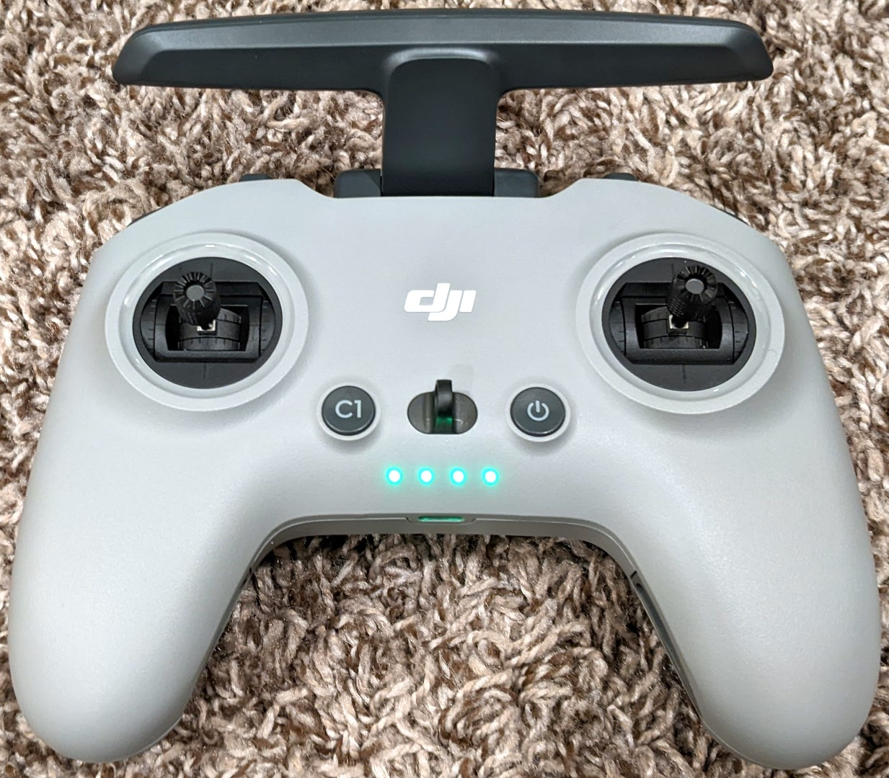

# DJI FPV LED Cover

**IMPORTANT:** Please be aware that these designs are licensed under [CC BY-NC-SA 4.0](https://creativecommons.org/licenses/by-nc-sa/4.0/). In short, you can print them and modify them freely for personal use. But if you want to use them commercially or sell them for profit, you'll need to contact me for a different license. Please give me credit when you can, and if you make significant changes please share those too.

## Background

It's awesome that you can use the DJI FPV Controller in PC simulators. What's not cool is having those bright controller LEDs flashing at you the whole time.

This print is probably my most over-engineered solution to a simple problem ever. Sure, we could use electrical tape. But this keeps sticky residue off the controller and IMO looks a lot cooler.

## Design

The Fusion 360 design file is [LEDCover.f3d](Design/LEDCover.f3d). It's fully parametric using **Modify -> Change Parameters**.

| Name | Default | Comments |
|---------------------|-------|--------------------------------------------------------------------|
| BottomEdgeRadius      | 2 mm   | Radius of the bottom edges over the LEDs                                |
| ButtonCenterGap       | 20 mm  | Usable space between the two buttons                                    |
| ButtonCenterToCenter  | 35 mm  | Distance between the center of the two buttons                          |
| ButtonDiameter        | 15 mm  | How wide the buttons are                                                |
| ControllerFilet       | 15 mm  | Radius of the controller filet below the buttons                        |
| CoverLength           | 8.5 mm | How far the LED cover extends below the loop                            |
| CoverWidth            | 35 mm  | Width of the LED Cover                                                  |
| EdgeFilet             | 0.6 mm | Filet radius for most outer edges.                                      |
| LoopBottomFilet       | 1.5 mm | Filet for the bottom of the Loop                                        |
| LoopLength            | 8 mm   | Lanyard Loop Length                                                     |
| LoopToControllerFilet | 1 mm   | Distance from center point of the loop to where controller filet begins |
| LoopTopFilet          | 0.5 mm | Filet for the top of the loop                                           |
| LoopWidth             | 3 mm   | Landard Loop Width                                                      |
| SubSurfaceDepth       | 5 mm   | How far below the surface the cover extends                             |
| SurfaceHeight         | 2 mm   | How tall the cover is on the top surface of the remote                  |
| TopEdgeRadius         | 8 mm   | Radius of the top edge near the loop                                    |

## Printing

Time Lapse:

Two ways to print:

1. [LEDCover-Prusa.3mf](Print/LEDCover-Prusa.3mf) - A Prusa Slicer project ready to print with recommended settings
2. [LEDCover.3mf](Print/LEDCover.3mf) - Regular 3MF without any parameters (see recommended settings below)

Because this part is so small I recommend a layer height of 0.10mm and 100% infill. Though it will require more support material, I recommend printing this part vertically since the final part will look more clean. For most printers, supports will NOT be needed at the top of the loop hole.