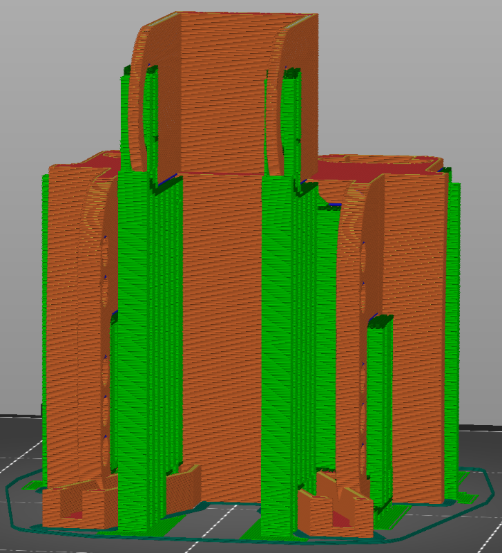

# Timber DJI FPV Mount

**IMPORTANT:** Please be aware that these designs are licensed under
[CC BY-NC-SA 4.0](https://creativecommons.org/licenses/by-nc-sa/4.0/). In short,
you can print them and modify them freely for personal use. But if you want to
use them commercially or sell them for profit, you'll need to contact me for a
different license. Please give me credit when you can, and if you make
significant changes please share those too.

## Background

This print was created to mount the [DJI Digital FPV](https://www.dji.com/fpv)
system to E-flite Timber series aircraft
([Timber](https://www.horizonhobby.com/product/timber-1.5m-bnf-basic-as3x-with-floats/EFL5250.html),
[Turbo Timber](https://www.horizonhobby.com/product/turbo-timber-evolution-1.5m-bnf-basic-includes-floats/EFL105250.html),
[Timber X](https://www.horizonhobby.com/product/timber-x-1.2m-bnf-basic-with-as3x-and-safe-select/EFL38500.html)
and
[Night Timber](https://www.horizonhobby.com/product/night-timber-x-1.2m-bnf-basic-with-as3x-and-safe-select/EFL13850.html)).

I can't take full credit for this design as it's a combination (and
modification) of work from other talented modelers (see below).

The mount is ready to fly after printing, but I recommend adding a bit of Velcro
or double-sided sticky tape under the rear of the mount if you plan to fly
inverted. The mount shouldn't fall off, but it may bounce when entering or
exiting the inversion.

## Design

The Fusion 360 design file is [TimberDJIFPV.f3d](Design/TimberDJIFPV.f3d).
Unlike most of my models, this design is not parametric. It's a combination of
several models plus additional customization.

This design leverages parts from the following models:

- [DJI Digital FPV Air Unit and Camera mount](https://www.thingiverse.com/thing:4082399)
  by [UltrasoundJelly](https://www.thingiverse.com/ultrasoundjelly/designs)
- [DJI FPV Camera and Transmitter External Mount](https://www.thingiverse.com/thing:3931186)
  by [Brett](https://www.thingiverse.com/brett/designs)
- [Air Unit Mount](https://www.rcgroups.com/forums/showpost.php?p=43422775&postcount=3308)
  by [Flynn203](https://www.rcgroups.com/forums/member.php?u=320757)
- [E-Flite Timber 1.5 m FPV Module](https://www.thingiverse.com/thing:4408089)
  by [kiefersavoie](https://www.thingiverse.com/kiefersavoie/designs)

Special thanks to all of those authors for making this design possible.

## Printing

Two ways to print:

1. [TimberDJIFPV.3mf](Print/TimberDJIFPV.3mf) - A Prusa Slicer project ready to
   print with recommended settings below
2. [TimberDJIFPV.stl](Print/TimberDJIFPV.stl) - Regular STL without any
   parameters (see recommended settings below)

### Recommended settings

For this model PLA is **NOT recommend** for the following reasons:

- PLA can be brittle
- PLA has relatively low tensile strength compared to other materials
- PLA does not weather well in the sun

Instead, PETG is recommended for this design. Nylon materials like Alloy 910 are
also an option, but nylon supports are notoriously difficult to remove and this
model does require several supports.

I recommend a layer height of 0.2 mm and 30% infill. Printing with the antenna
supports on the base will require the fewest supports. The large holes that can
be used to secure the air unit do not require supports, but I do recommend using
supports for the crescent moon shaped hole on the camera mount.

Here are two photos of the recommended print configuration:

