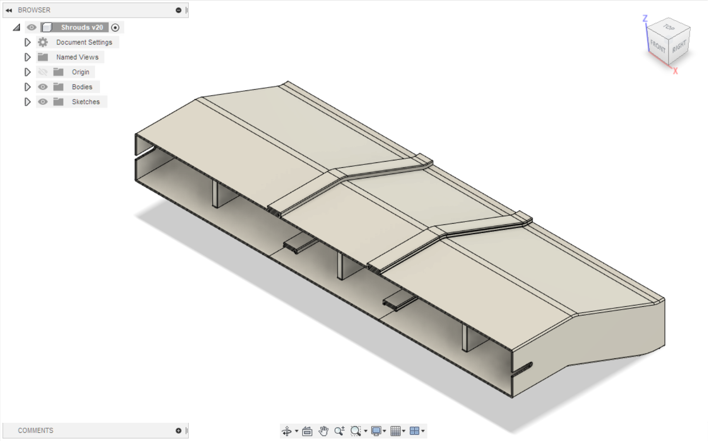
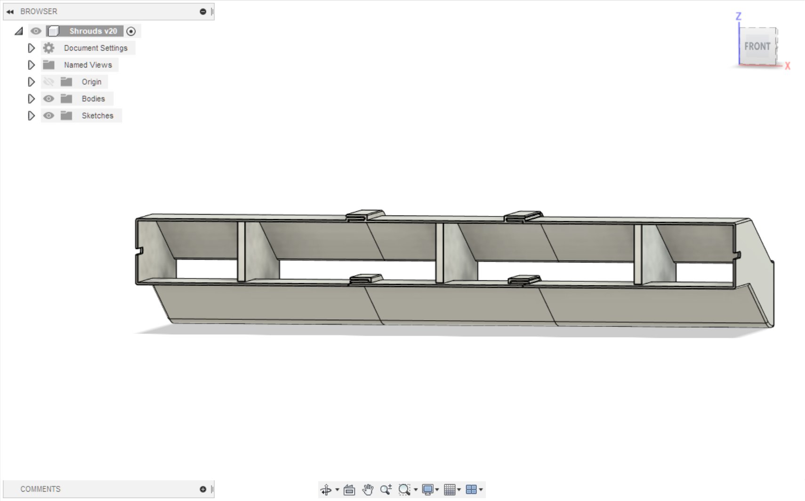
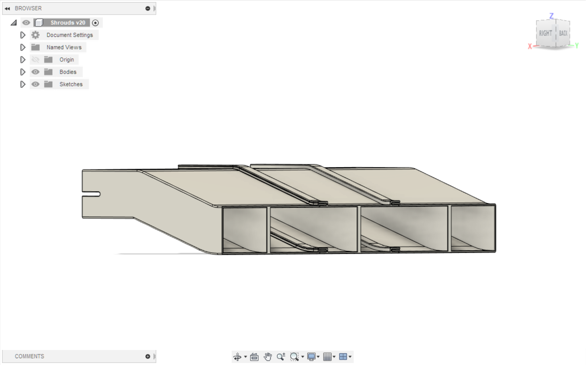
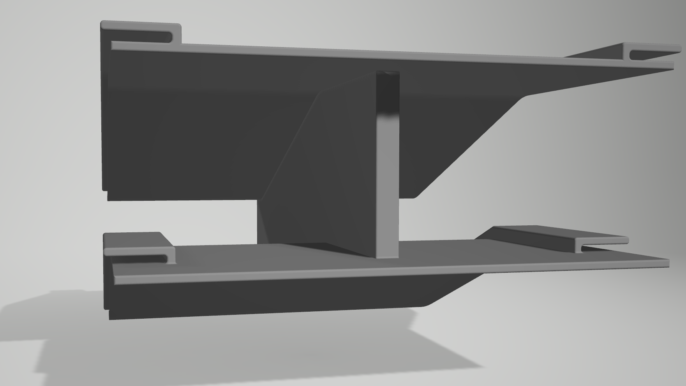
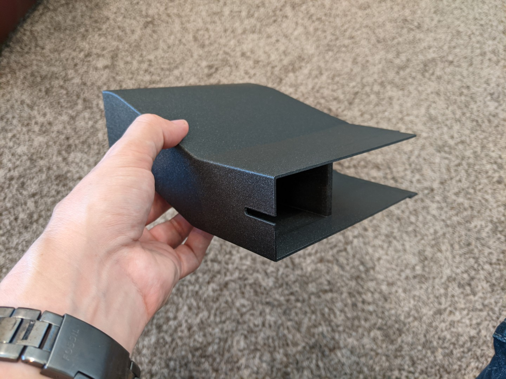
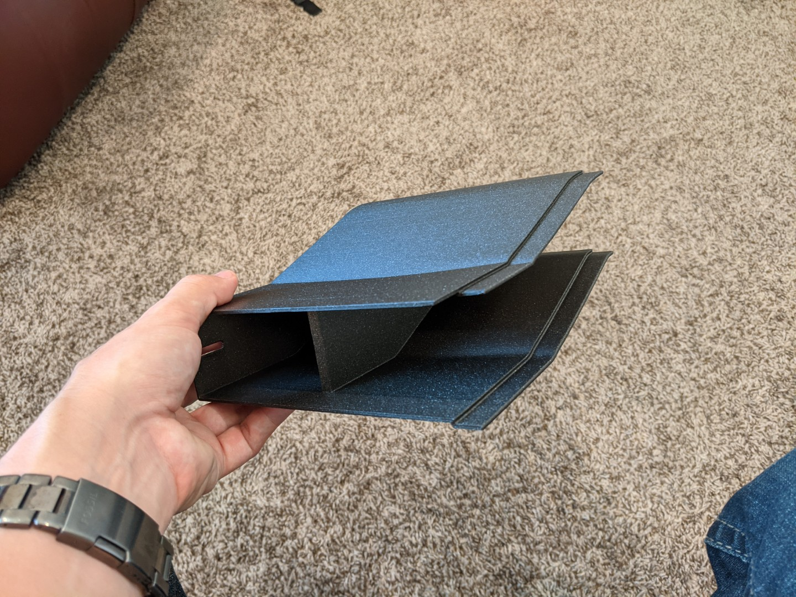
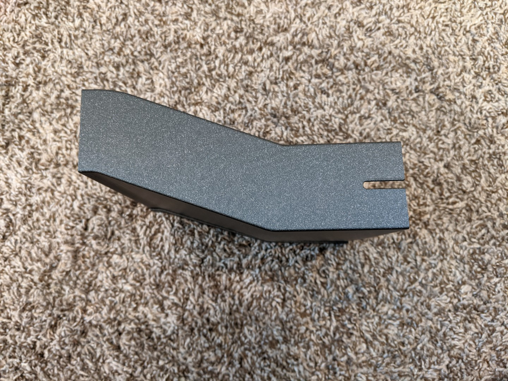
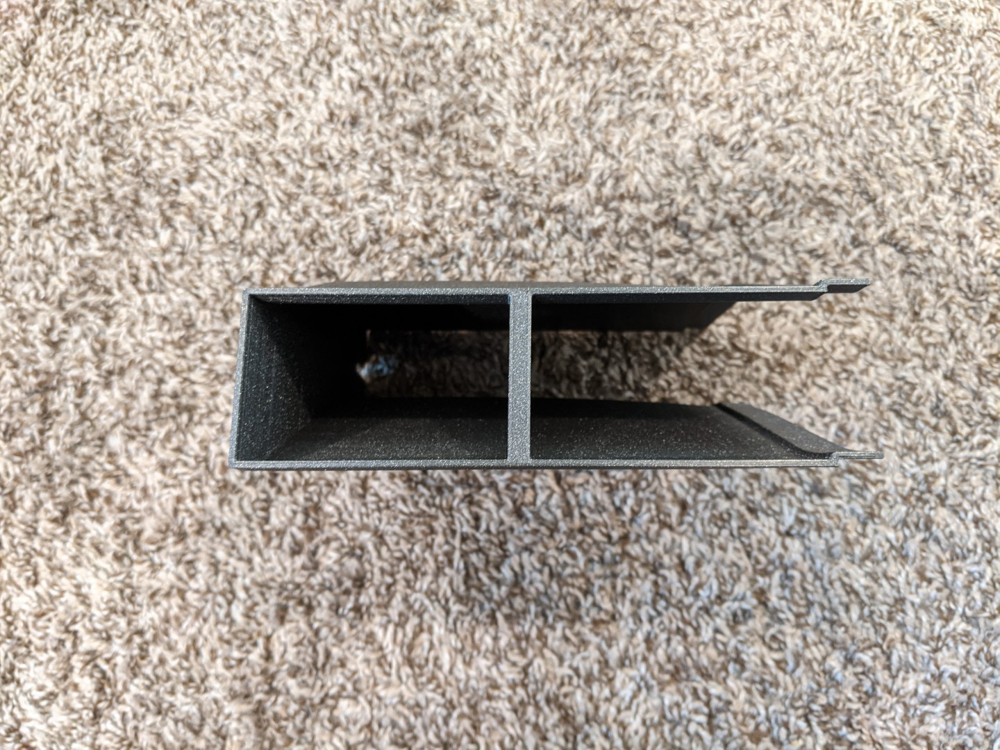
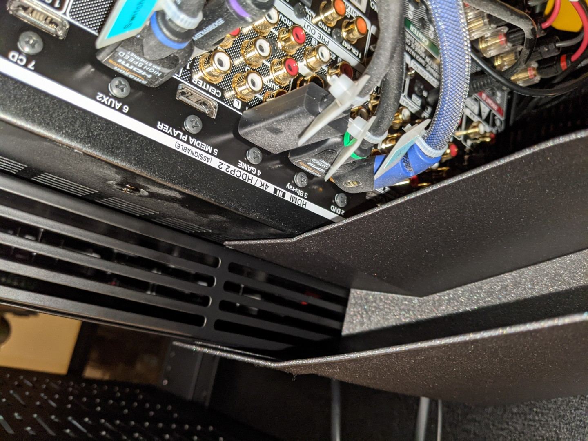

# Media Room Fan Shroud

**IMPORTANT:** Please be aware that these designs are licensed under
[CC BY-NC-SA 4.0](https://creativecommons.org/licenses/by-nc-sa/4.0/). In short,
you can print them and modify them freely for personal use. But if you want to
use them commercially or sell them for profit, you'll need to contact me for a
different license. Please give me credit when you can, and if you make
significant changes please share those too.

## Background

This fan shroud was created to route heat exhaust from an amplifier down and out
of the lower air vent in a media rack. This was better than allowing it to pool
up at the top of the rack where the PC was mounted.

This is designed to attach to the
[AC Infinity CLOUDPLATE T5](https://www.amazon.com/dp/B07B4QY1C8), but could
easily be adapted to other equipment by modifying the parameters outlined below.
It is designed in 3 sections that snap together so it can be printed even on a
Prusa Mini with 180mm x 180mm print volume.

## Design

The Fusion 360 design file is [FanShroud.f3d](Design/FanShroud.f3d). It's fully
parametric, allowing you to adjust to different equipment using Modify -> Change
Parameters.

| Name               | Expression | Comments                                    |
| ------------------ | ---------- | ------------------------------------------- |
| ShroudThickness    | 2 mm       | Wall thickness of the shroud                |
| MaxPrintWidth      | 170 mm     | Maximum width to fit on the printer bed     |
| AVPlateWidth       | 441.325 mm | Width of the AC Infinity CLOUDPLATE T5      |
| AVPlateHeight      | 45 mm      | Height of the AC Infinity CLOUDPLATE T5     |
| ConnectWidth       | 12 mm      | Width of connection tabs                    |
| AttachLength       | 19 mm      | Length of attachment points                 |
| FlareLength        | 10 mm      | Length of the exhaust flare                 |
| AVSlope            | 36 mm      | Slope angle of the shroud for air direction |
| LoftFiletRadius    | 20 mm      | Radius of main fillet curves                |
| ProfileFiletRadius | 1.5 mm     | Radius of profile fillets                   |
| ConnectFiletRadius | 0.75 mm    | Radius of connection fillets                |
| EdgeFilet          | 0.5 mm     | Radius of edge fillets                      |
| MaxPrintHeight     | 180 mm     | Maximum height to fit on the printer bed    |
| AttachExtension    | 55 mm      | Extension length of attachment arms         |
| SupportWidth       | 6 mm       | Width of support structures                 |
| CableRadius        | 2 mm       | Radius of cable routing channels            |

## Printing

The shroud is designed to print in three pieces for maximum compatibility with
standard printer bed sizes:

1. [Bridge.stl](Print/Bridge.stl) / [Bridge.3mf](Print/Bridge.3mf)
2. [Left Wing.stl](Print/Left%20Wing.stl) /
   [Left Wing.3mf](Print/Left%20Wing.3mf)
3. [Right Wing.stl](Print/Right%20Wing.stl) /
   [Right Wing.3mf](Print/Right%20Wing.3mf)

The .3mf files include recommended print settings such as supports and infill. I
recommend printing with a layer height of 0.20mm. Infill of 20% is sufficient,
though most of these pieces print solid due to their thickness. It's really on
the middle section of each piece that uses infill.

The parts can optionally be glued together, but they do hold pretty well with
just compression.

## Images

