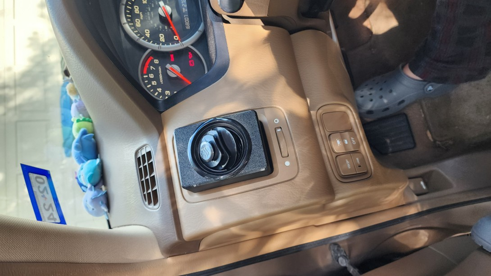
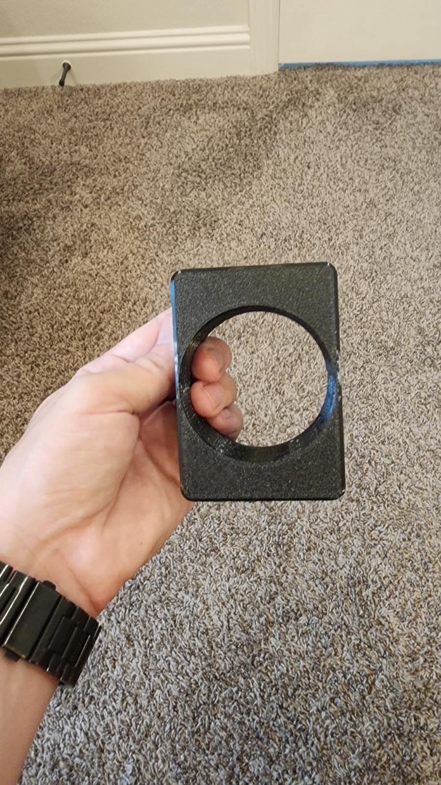
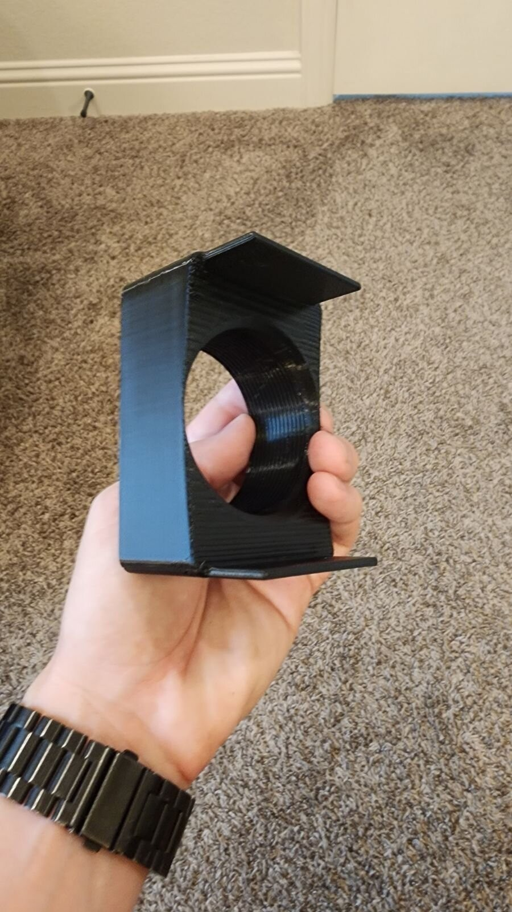
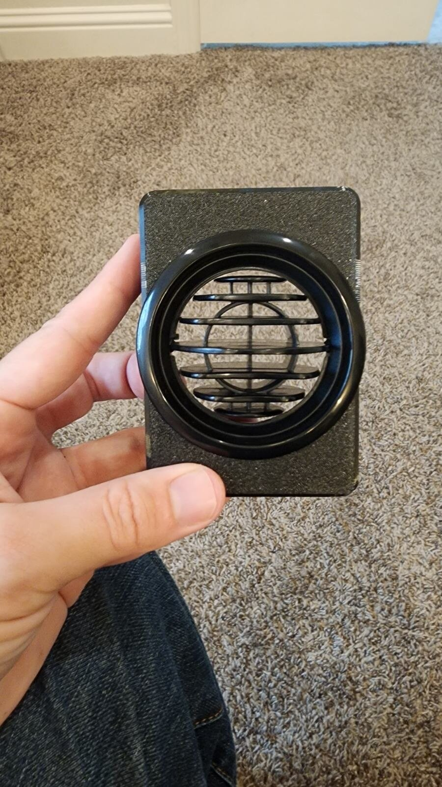
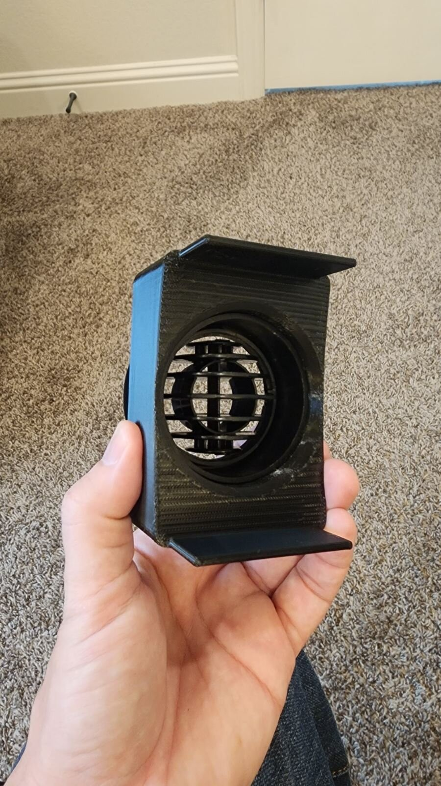
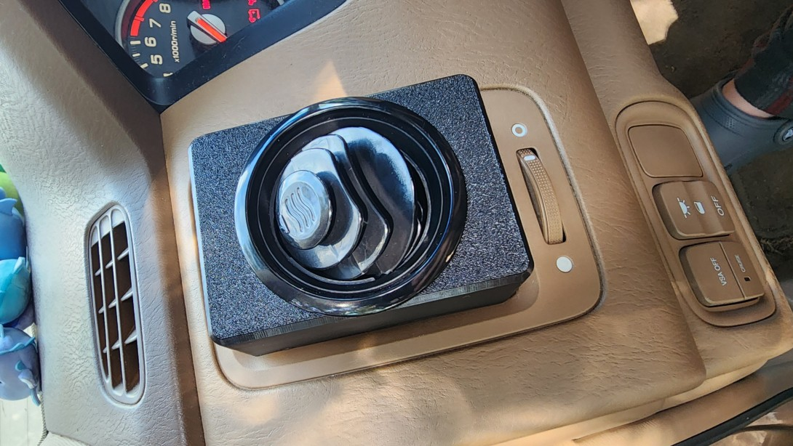

# Air Vent Adapter

**IMPORTANT:** Please be aware that these designs are licensed under
[CC BY-NC-SA 4.0](https://creativecommons.org/licenses/by-nc-sa/4.0/). In short,
you can print them and modify them freely for personal use. But if you want to
use them commercially or sell them for profit, you'll need to contact me for a
different license. Please give me credit when you can, and if you make
significant changes please share those too.

## Background

 I created this because my
daughter wanted to better direct the air conditioning onto herself and onto her
dog. Her dog was especially lower in the seat than the stock vents would direct
the airflow. These adapters do not require removing the stock vents. I applied
small adhesive rubber tabs to help them stay secure and not rattle. It uses this
threaded
[Deflector Vent](https://www.amazon.com/dp/B09FDMGWDQ?ref_=ppx_hzsearch_conn_dt_b_fed_asin_title_3)
from Amazon.

## Design

The model is parametric. The Fusion 360 design file is included below:

- [`VentAdapter.f3d`](Design/VentAdapter.f3d) (parametric Fusion 360 file) —
  located in the `Design` folder.

### Parameters

The following parameters are exported from the design (Name, Expression,
Comments):

| Name                  | Expression                                                                  | Comments                               |
| --------------------- | --------------------------------------------------------------------------- | -------------------------------------- |
| VentWidth             | 70.5 mm                                                                     |                                        |
| VentHeight            | 96.8 mm                                                                     |                                        |
| VentRadius            | 5.5 mm                                                                      |                                        |
| VentInsertDepth       | 25 mm                                                                       |                                        |
| VentInsertThickness   | 3 mm                                                                        |                                        |
| VentAdapterDepth      | VentHoleThreadHeight + StockVentTabHeight                                   |                                        |
| VentHoleRadius        | 63 mm                                                                       |                                        |
| DashCurveRadius       | 600 mm                                                                      |                                        |
| DashCurveInset        | 4 mm                                                                        |                                        |
| VentLegAttachDepth    | 0.5 mm                                                                      |                                        |
| VentBottomFiletRadius | 1.2 mm                                                                      |                                        |
| VentHoleTestThickness | 4 mm                                                                        |                                        |
| VentHoleTestHeight    | 4 mm                                                                        |                                        |
| VentLegDepth          | 20 mm                                                                       |                                        |
| VentHoleThreadHeight  | 28 mm                                                                       |                                        |
| StockVentTabHeight    | 12 mm                                                                       | To clear the stock pivot tab           |
| VentHoleThreadPitch   | 1.75 mm                                                                     |                                        |
| PrintShrinkage        | 1.4 mm                                                                      | How much the part shrinks when printed |
| ThreadMinorDiameter   | 61.8 mm                                                                     |                                        |
| ThreadMajorDiameter   | 63 mm                                                                       |                                        |
| ThreadPitch           | 2.0 mm                                                                      |                                        |
| ThreadPitchDiameter   | ( ( ThreadMajorDiameter - ThreadMinorDiameter ) / 2 ) + ThreadMinorDiameter |                                        |
| VentLegSlopeAngle     | 5 deg                                                                       | Angle the legs pitch inward            |

## Printing

Print files are in the `Print` folder.

- [`VentAdapter.stl`](Print/VentAdapter.stl) — raw geometry suitable for
  slicing.
- [`VentAdapter.3mf`](Print/VentAdapter.3mf) — includes recommended print
  settings (supports, infill, and other slicer-specific settings).

## Images

