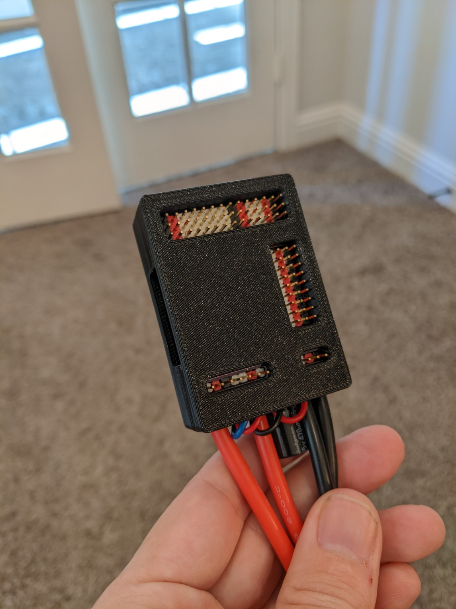

# Mateksys H743 Wing V2 Snap Mount

**IMPORTANT:** Please be aware that these designs are licensed under
[CC BY-NC-SA 4.0](https://creativecommons.org/licenses/by-nc-sa/4.0/). In short,
you can print them and modify them freely for personal use. But if you want to
use them commercially or sell them for profit, you'll need to contact me for a
different license. Please give me credit when you can, and if you make
significant changes please share those too.

## Background

This print is a solid self-snapping mount for the
[Mateksys H743 Wing V2](http://www.mateksys.com/?portfolio=h743-wing-v2).

It can be hot glued into foam planes, or it can be screwed into wood planes with
a US #4 wood screw or similar.

The top lid securely snaps into the base, but can be separated again with a bit
of force. It is designed to remain secure in flight, but not require so much
force to open that the base would come unglued. This allows for the Wing V2 to
be removed and worked on then returned to the aircraft.

If snapping ever becomes too loose (due to repeated opening and closing), simply
reprint the top lid.

## Design

The Fusion 360 design file is [H743V2SnapMount.f3d](Design/H743V2SnapMount.f3d).

It's fully parametric using **Modify -> Change Parameters**.

| Name                  | Default      | Comments                                                     |
| --------------------- | ------------ | ------------------------------------------------------------ |
| BottomHeight          | 4 mm         | Height of the base                                           |
| BottomWallHeight      | (Calculated) | Height of bottom walls                                       |
| CapBottomOffset       | 3 mm         | Offset between bottom of board and capacitor                 |
| CapDiameter           | 10.2 mm      | Diameter of the capacitor                                    |
| CapHeight             | 16 mm        | Height of the capacitor                                      |
| GrabDiameter          | 2.5 mm       | Diameter of the grab rails                                   |
| GrabWidth             | 28 mm        | Width of grab handles                                        |
| InnerGap              | 0.5 mm       | Gap between Wing and Wall                                    |
| MountFiletRadius      | 0.5 mm       | Radius of outside wall filet                                 |
| MountHoleOffset       | 7 mm         | Offset between board edge and mount hole                     |
| OuterRadius           | 2 mm         | The outside radius of the case.                              |
| PinsBackLength        | 8.5 mm       | Length of the hole for the back pins header                  |
| PinsFrontLeftWidth    | 18 mm        | Width of the hoe for the front-left pins                     |
| PinsFrontLength       | 4 mm         | Length of the hole for the front pins                        |
| PinsFrontOffset       | 4.25 mm      | Offset from front of the top board to the front holes        |
| PinsFrontRightWidth   | 8.5 mm       | Width of the hole for the front-right pins                   |
| PinsHoleRadius        | 1 mm         | Radus of the cut holes for the pins                          |
| PinsRightLength       | 24 mm        | Length of the hole for the right pins header                 |
| PinsRightWidth        | 8.5 mm       | With of hole for the right pins header                       |
| ScrewHeadAngle        | 82 deg       | Head angle of #4 screw                                       |
| ScrewHeadDiameter     | 0.225 in     | Head diameter for #4 screw                                   |
| ScrewShankDiameter    | 0.112 in     | Shank diameter for #4 screw                                  |
| SnapDiameter          | 1.25 mm      | Diameter of the snap components                              |
| SplitHeight           | (Calculated) | The height at where the top and bottom are split             |
| TabCenterOffset       | 19 mm        | Distance from center of mount to center of tabs.             |
| TabNotchWidth         | 1 mm         | The cut that separates the tab from the overlap.             |
| TabWidth              | 8 mm         | Width of the compression tabs in the lid.                    |
| TopHeight             | 4.5 mm       | Height of the top cover                                      |
| TopWallHeight         | (Calculated) | Height of top walls                                          |
| TopWireOverhang       | 2 mm         | How much the top hangs over the wire port on the front edge. |
| TotalHeight           | (Calculated) | Total height of the entire mount                             |
| WallOverlap           | 2 mm         | The total amount that the walls overlap                      |
| WallOverlapGap        | 0.2 mm       | The gap between the top and bottom walls                     |
| WallThickness         | 4 mm         | How thick the walls are                                      |
| WingBoardRadius       | 2.25 mm      | Radius of the board filet                                    |
| WingBottomCenterToCap | 5 mm         | Offset from center to cap                                    |
| WingBottomHeight      | 1.65 mm      | Height of the bottom circuit board                           |
| WingBottomToTop       | 12.8 mm      | From bottom of board to top of board                         |
| WingLegnth            | 54 mm        | Length of the bottom circuit board                           |
| WingPortFiletRadius   | 1.0 mm       | Radius of the hole for the connector port                    |
| WingPortWidth         | 26.4 mm      | Width of the port area including SD                          |
| WingWidth             | 35.9 mm      | Width of all 3 circuit boards                                |
| WireGap               | 1 mm         | Extra gap around wire area                                   |

## Printing

Two ways to print:

1. [SnapMount.3mf](Print/SnapMount.3mf) - A Prusa Slicer project ready to print
   both halves with the recommended settings below.
2. [Bottom.stl](Print/Bottom.stl) and [Top.stl](Print/Top.stl) - The two STL
   halves without any parameters (see recommended settings below).

### Recommended settings

For this model PLA is not recommend since the snap joints will wear out more
quickly. PETG is preferred.

I recommend a layer height of 0.15 mm to help round out the snap joints and 20%
infill is sufficient. No supports are necessary.
