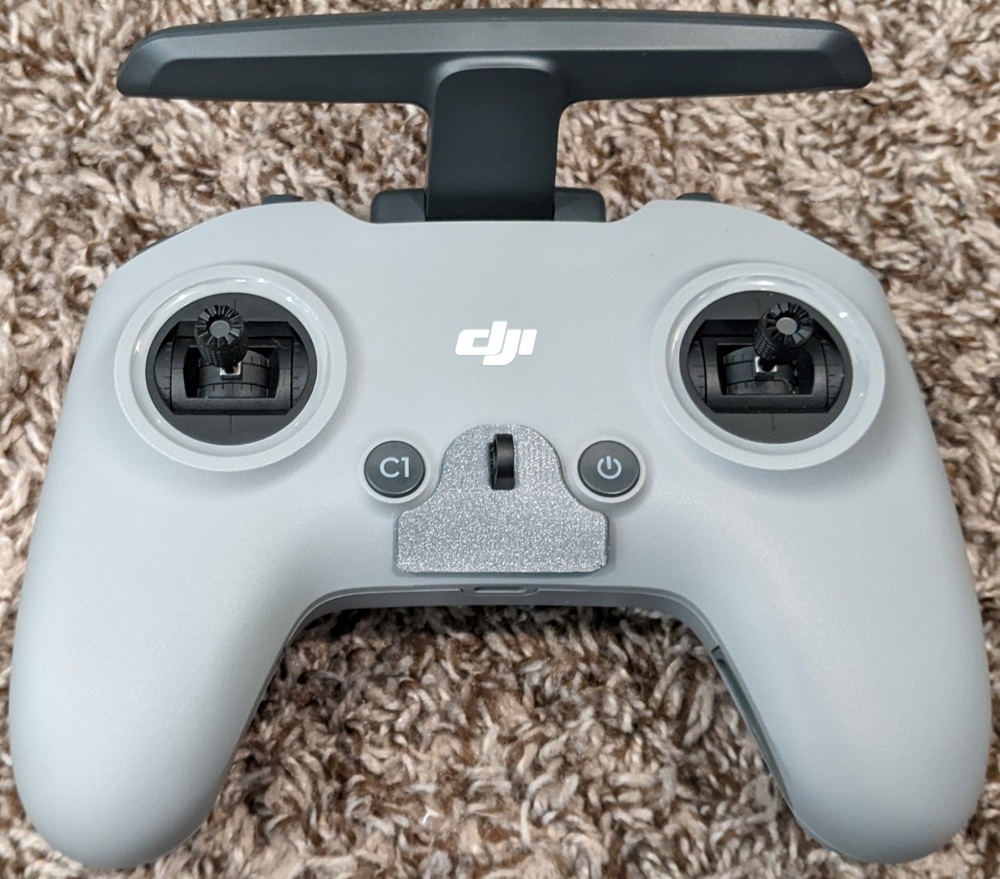
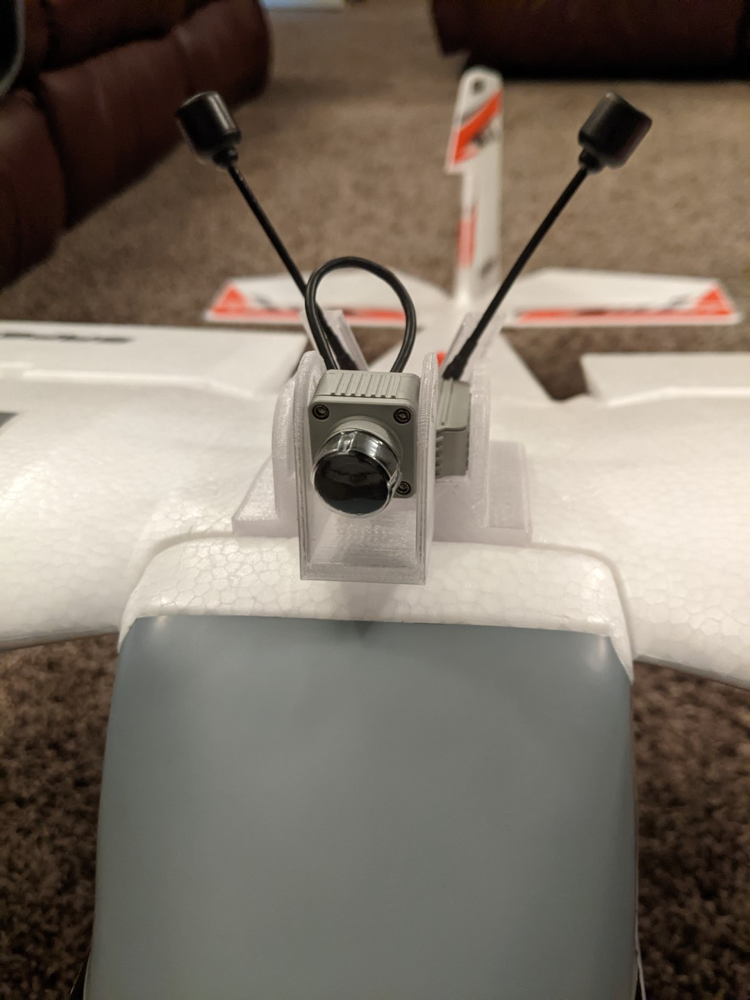
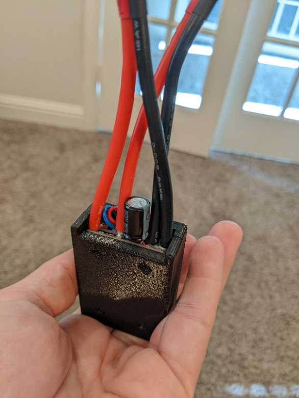
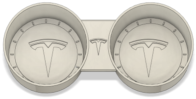

# 3D Printables

This repository includes various 3D Printable designs that I've created and want to share. I usually include printable STLs as well as the original Fusion 360 files. Whenever possible, I make my Fusion designs parametric for easy modification.

**IMPORTANT:** Please be aware that these designs are licensed under [CC BY-NC-SA 4.0](https://creativecommons.org/licenses/by-nc-sa/4.0/). In short, you can print them and modify them freely for personal use. But if you want to use them commercially or sell them for profit, you'll need to contact me for a different license. Please give me credit when you can, and if you make significant changes please share those too.

## Models

### DJI

[FPV LED Cover](DJI/FPV/LEDCover) - A cover that keeps LEDs from blinding you while learning to fly in sims.

### Eflite

[Timber DJI FPV Mount](Eflite/Timber/DJIFPV) - Mount the DJI Digital FPV system to E-flite Timber series aircraft.

### Mateksys

[H743 Wing V2 Snap Mount](Mateksys/H743V2/SnapMount) - A cover that keeps LEDs from blinding you while learning to fly in sims.

### Tesla

[Model 3 Cup Holders](Tesla/Model3/CupHolders) - Washable inserts with Tesla logo.