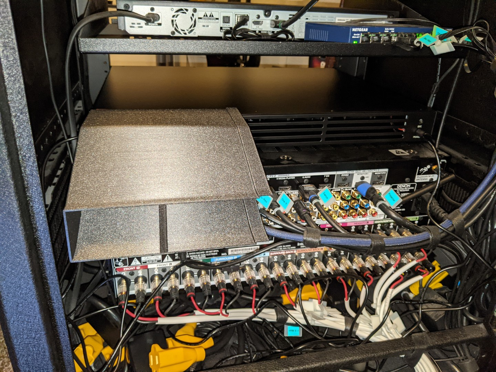
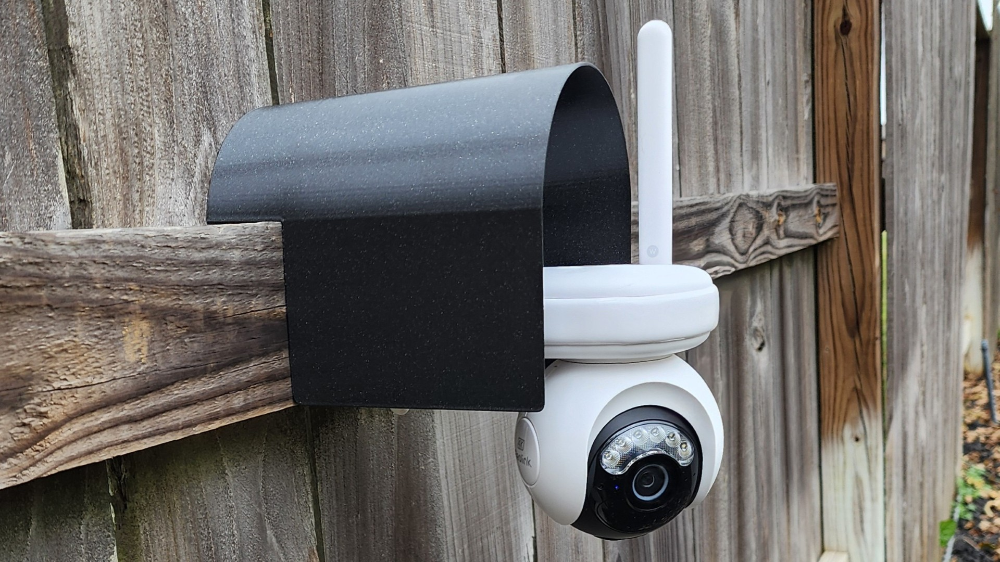
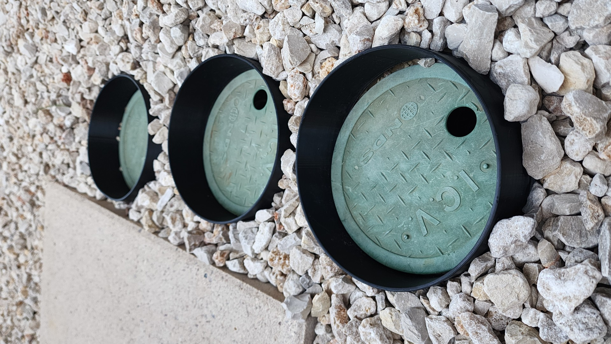
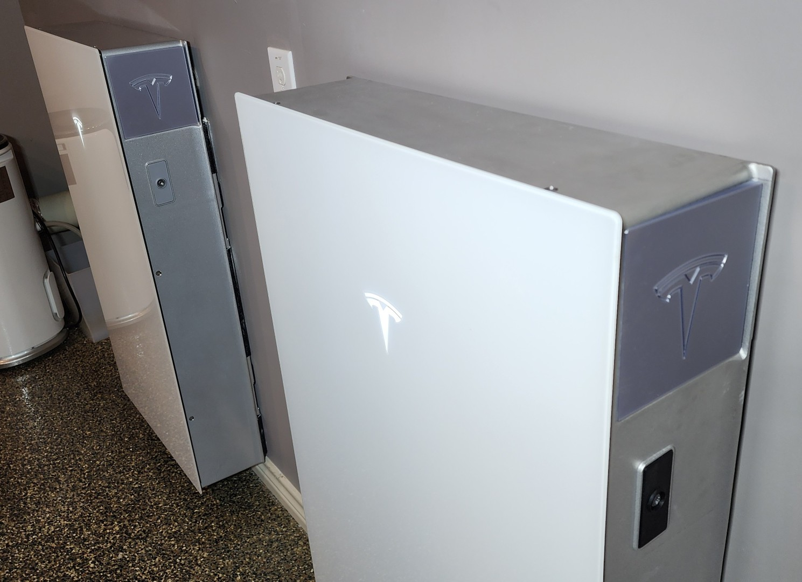

# 3D Printables

This repository includes various 3D Printable designs that I've created and want
to share. I usually include printable STLs as well as the original Fusion 360
files. Whenever possible, I make my Fusion designs parametric for easy
modification.

**IMPORTANT:** Please be aware that these designs are licensed under
[CC BY-NC-SA 4.0](https://creativecommons.org/licenses/by-nc-sa/4.0/). In short,
you can print them and modify them freely for personal use. But if you want to
use them commercially or sell them for profit, you'll need to contact me for a
different license. Please give me credit when you can, and if you make
significant changes please share those too.

## Models

### DJI

[FPV LED Cover](DJI/FPV/LEDCover) - A cover that keeps LEDs from blinding you
while learning to fly in sims.

### Eflite

[Timber DJI FPV Mount](Eflite/Timber/DJIFPV) - Mount the DJI Digital FPV system
to E-flite Timber series aircraft.

### Home

[Media Room Fan Shroud](Home/MediaRoom/FanShroud) - Route heat exhaust from a
Denon amplifier down and out through lower ventilation, compatible with the
[AC Infinity CLOUDPLATE T5](https://www.amazon.com/dp/B07B4QY1C8).

### Honda

[Air Vent Adapter](Honda/Pilot2007/VentAdapter) - Adapter to better direct air
conditioning in a Honda Pilot, compatible with threaded deflector vents.

### Mateksys

[M8Q-5883 Slide Mount](Mateksys/M8Q5883/SlideMount) - A friction mount for a
popular GPS / Compass unit.

[H743 Wing V2 Snap Mount](Mateksys/H743V2/SnapMount) - a solid self-snapping
mount can be hot glued into foam planes or screwed into wood planes.

### Reolink

[Atlas PT Ultra Hood](Reolink/AtlasPTUltra/Hood) - A hood designed to shield
most of the housing and connections from rain and direct sunlight.

### Sprinkler

[Valve Collars](Sprinkler/ValveCollars) - Collars designed for a standard US 6"
round valve box to keep decorative fill rocks from covering up and preventing
access to the valves.

### Tesla

[Model 3 Cup Holders](Tesla/Model3/CupHolders) - Washable inserts with Tesla
logo.

[Powerwall 3 Port Covers](Tesla/Powerwall3/PortCovers) - Cover unsightly ports
while staying on-brand.
