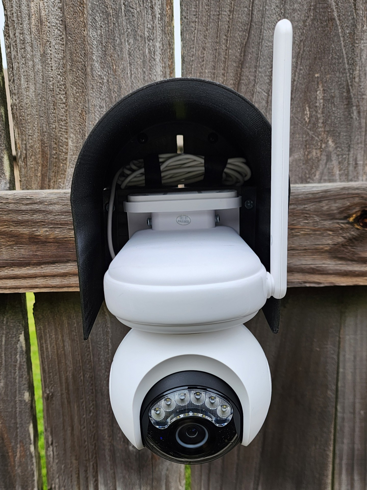
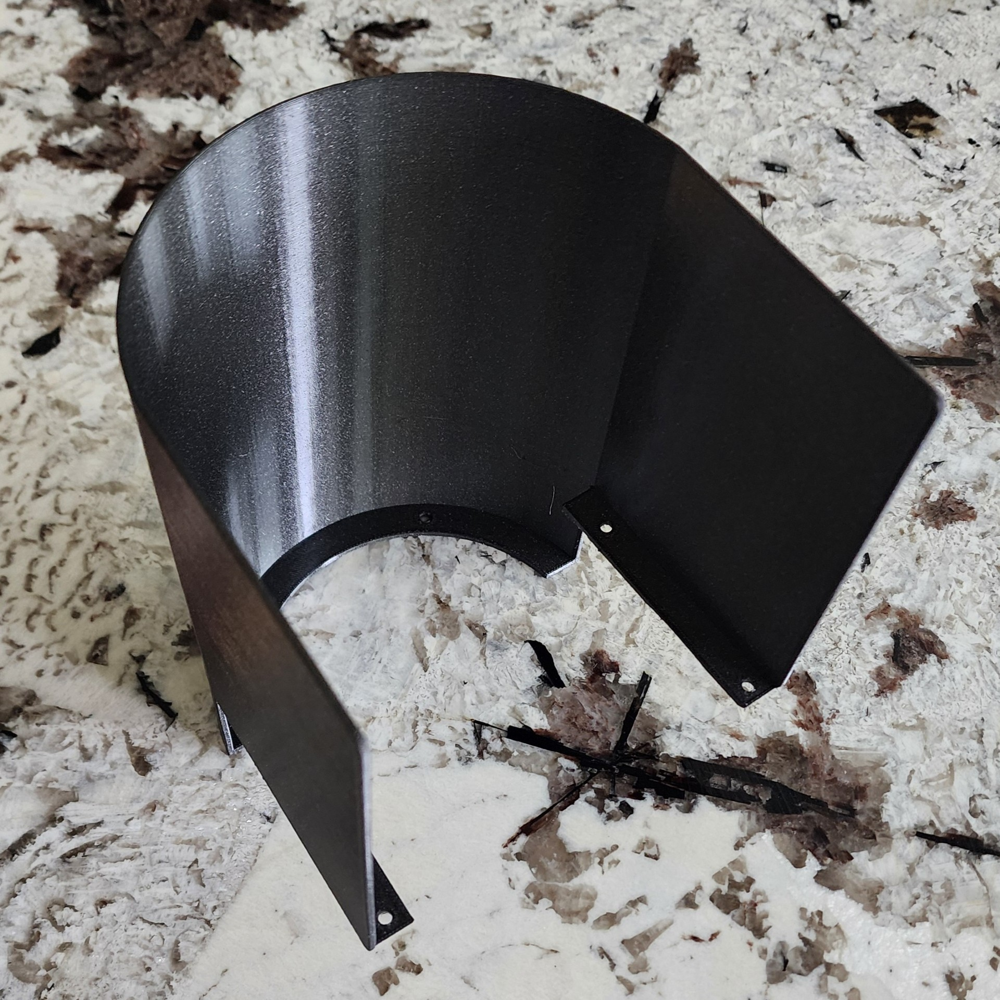
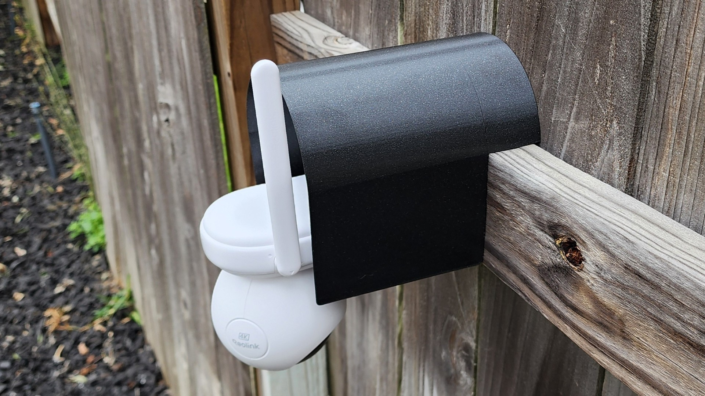

# Reolink Atlas PT Ultra Hood

**IMPORTANT:** Please be aware that this design is licensed under
[CC BY‑NC‑SA 4.0](https://creativecommons.org/licenses/by-nc-sa/4.0/). In short,
you can print it and modify it freely for personal use. But if you want to use
it commercially or sell it for profit, you'll need to contact me for a different
license. Please give me credit when you can, and if you make significant changes
please share those too.

## Background

This hood was designed to protect the body and connectors from rain and sun.

## Design

The Fusion 360 design file is
[AltasPTUltraHood.f3d](Design/AltasPTUltraHood.f3d). It's parameters allow you
to change the hood's arch height, wall height, notch depth (for the fence) and
other features. Parameters are exported in
[Parameters.csv](Design/Parameters.csv).

| Name                 | Expression | Comments                                               |
| -------------------- | ---------- | ------------------------------------------------------ |
| InnerWidth           | 130 mm     | Width inside the hood                                  |
| WallHeight           | 86 mm      | Height inside the hood                                 |
| NotchHeight          | 86 mm      | How tall the notch is                                  |
| NotchDepth           | 42 mm      | How deep the notch is                                  |
| InnerDepth           | 168 mm     | How deep the hood extends away from the mounting plate |
| MountingDepth        | 2 mm       | How deep the mounting plate extends                    |
| MountingWidth        | 12 mm      | How wide the mounting point surface is                 |
| OuterThickness       | 2 mm       | How thick the walls are                                |
| MountingHoleDiameter | 3.5 mm     | Diameter of mounting holes                             |
| MountingHoleCount    | 3 pcs      | Number of mounting holes                               |
| HoodRadius           | 65 mm      | Radius used for hood curvature                         |
| BottomCornerFilet    | 5 mm       | Fillet at bottom corners                               |
| NotchFillet          | 3 mm       | Fillet around the notch                                |
| ArchHeight           | 44 mm      | Height of the front arch                               |

If you need to tweak the fit for your particular mount or camera version, change
these parameters in Fusion 360 (Modify -> Change Parameters).

## Printing

Included print files:

1. [AtlasPTUltraHoodPrint.3mf](Print/AtlasPTUltraHoodPrint.3mf) - A slicer
   project ready to print with recommended settings (includes supports, infill,
   and other slicer settings).
2. [AtlasPTUltraHood.stl](Print/AtlasPTUltraHood.stl) - STL export for manual
   slicing.

I printed with usual 0.20 mm layer height. The hood does not require any infill
at the default 2mm thickness. Supports are only be needed for the notch area, if
used.

## Images

Additional photos:

