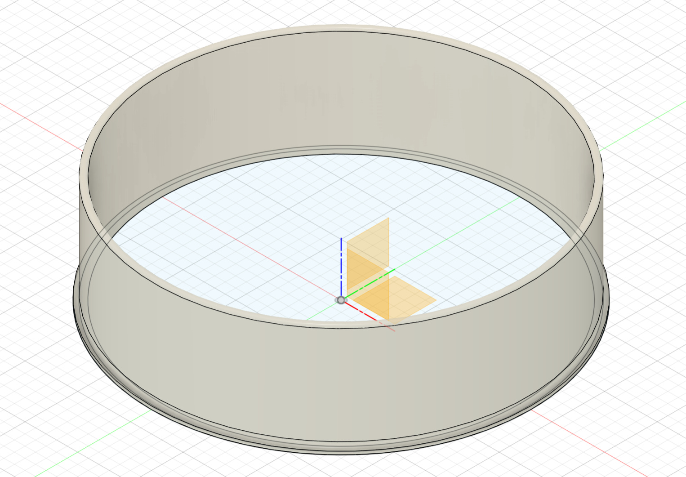

# ValveCollars

**IMPORTANT:** Please be aware that this design is licensed under
[CC BY‑NC‑SA 4.0](https://creativecommons.org/licenses/by-nc-sa/4.0/). In short,
you can print it and modify it freely for personal use. But if you want to use
it commercially or sell it for profit, you'll need to contact me for a different
license. Please give me credit when you can, and if you make significant changes
please share those too.

## Background

These collars are designed for a standard US 6" round valve box. They were
created to keep decorative fill rocks from covering up and preventing access to
the valves.

## Design

The model is parametric. The Fusion 360 design file is included below:

- [`ValveCollar.f3d`](Design/ValveCollar.f3d) (parametric Fusion 360 file) —
  located in the `Design` folder.

### Parameters

The following parameters are exported from the design (Name, Expression,
Comments):

| Name              | Expression                          | Comments                                           |
| ----------------- | ----------------------------------- | -------------------------------------------------- |
| InnerDiammeter    | 170 mm                              | The inner column the lid passes through            |
| WallThickness     | 3 mm                                | Thickness of the main wall                         |
| BaseExtension     | ( 180 mm - ( InnerDiammeter ) ) / 2 | Diameter of outer ring to go under rocks, etc.     |
| BaseHeight        | 4 mm                                | How tall the base should be before flange          |
| ColumnHeight      | 52 mm                               | How tall the total extension is from the ground up |
| BaseFiletDiameter | 4.1 mm                              | Diameter of the inward fillet                      |
| BaseFiletOffset   | 1.5 mm                              | How far from the groud does the filet start        |
| TopFiletDiameter  | 1.5 mm                              | How rounded the top edge is.                       |

## Printing

No infill or supports are necessary and this part _barely_ fits on a Prusa Mini.
Two ways to print:

- [`ValveCollar6in.stl`](Print/ValveCollar6in.stl) — Raw geometry suitable for
  slicing.
- [`ValveCollar6in.3mf`](Print/ValveCollar6in.3mf) — Prusa Slicer file with
  recommended print settings.
