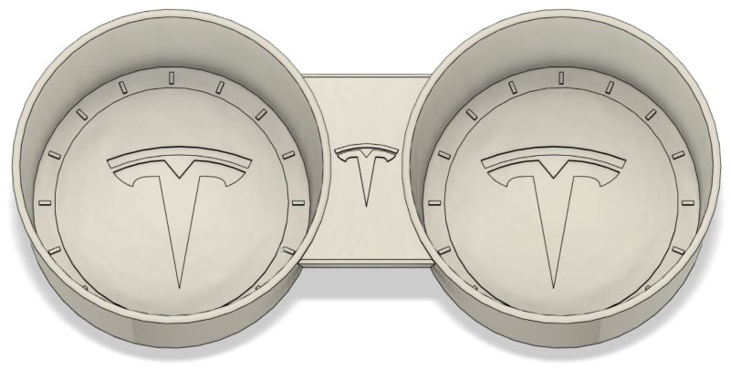
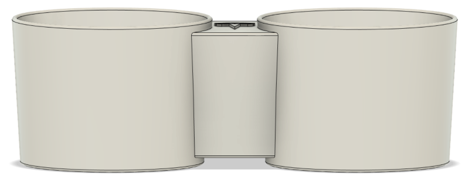
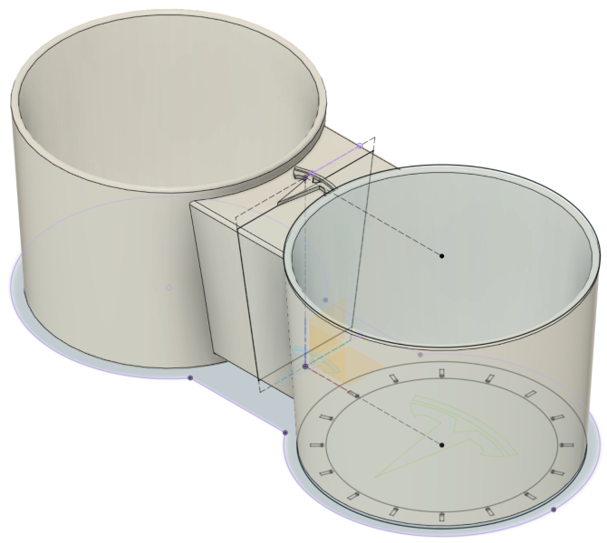
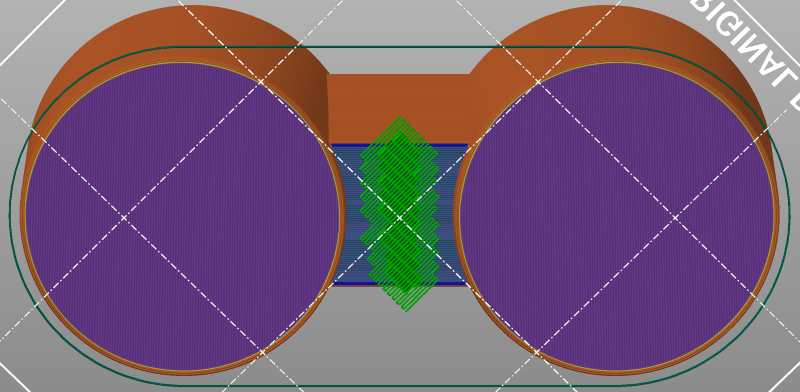
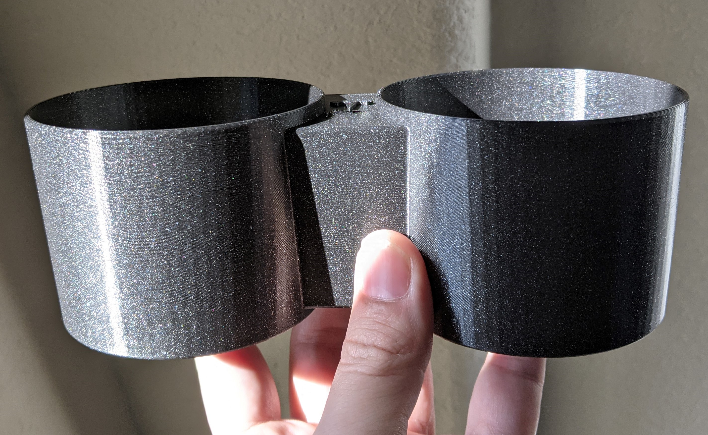
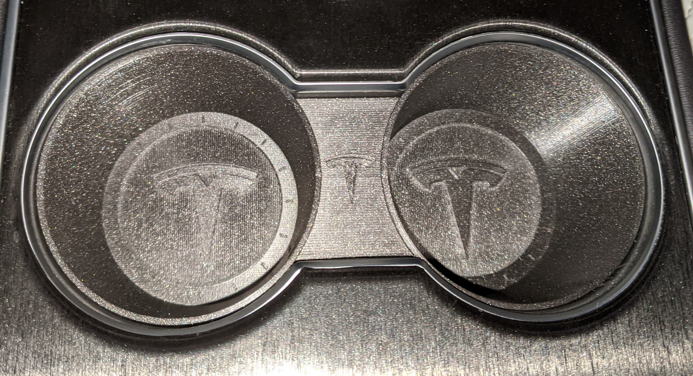

# Model 3 Cup Holders

**IMPORTANT:** Please be aware that these designs are licensed under
[CC BY-NC-SA 4.0](https://creativecommons.org/licenses/by-nc-sa/4.0/). In short,
you can print them and modify them freely for personal use. But if you want to
use them commercially or sell them for profit, you'll need to contact me for a
different license. Please give me credit when you can, and if you make
significant changes please share those too.

## Background

I created this because I'm always spilling coffee in my cup holders and they're
hard to wash clean! I bought several different options from Amazon and though
the designs were OK they, still didn't solve the coffee problem. These 3D
printed inserts are water tight, and they can easily be removed and washed out
in the sink.

## Design

The Fusion 360 design file is [CupHolders.f3d](Design/CupHolders.f3d). It's
fully parametric with many settings you can tweak (using Modify -> Change
Parameters). For example, the design could be easily modified to work in a Model
X.

| Name                | Expression | Comments                                                           |
| ------------------- | ---------- | ------------------------------------------------------------------ |
| CupBottomDiameter   | 75 mm      | Diameter of exterior bottom of the cup                             |
| CupTopDiameter      | 82 mm      | Diameter of exterior top of the cup                                |
| CupHeight           | 60 mm      | Total exterior height of the cup holder                            |
| CupCenterFromMiddle | 50 mm      | Distance between middle of the bridge and center of either cup     |
| CupWallThickness    | 2 mm       | Thickness of cup walls (protruding inward)                         |
| BridgeBottomWidth   | 33 mm      | Width of bridge exterior at the very bottom of cup holder          |
| BridgeTopWidth      | 51 mm      | Width of bridge exterior at the very top of cup holder             |
| FiletDiameter       | 1 mm       | Diameter of rounded corners wherever they are used                 |
| BridgeInset         | 4 mm       | Air gaps above and below the bridge                                |
| BasePatternInset    | 15 mm      | Distance between outer wall and where inner decorative ring begins |
| PatternThickness    | 1 mm       | Height of any patterns (e.g. logos)                                |

If for some reason the cup holders don't fit in your Model 3 it's probably the
`CupCenterFromMiddle` parameter. In my car 50.56mm was too wide but 50mm was
quite snug. It could probably be somewhere in between. If you find you need to
modify this please let me know what you changed it to.

## Printing

Time Lapse:

Two ways to print:

1. [CupHolders.3mf](Print/CupHolders.3mf) - A Prusa Slicer project ready to
   print with recommended settings
2. [CupHolders.stl](Print/CupHolders.stl) - Regular STL (see recommended
   settings below)

I usually print with a layer height of 0.20mm and 10% infill. If you have a 7"
bed like the Prusa MINI or MINI+, you'll need to place the part diagonally for
it to fit on the plate. The air gap between the two cups is 24.8mm. While many
printers can bridge this gap, I recommend painting on a small support to make
sure there's no sagging.

