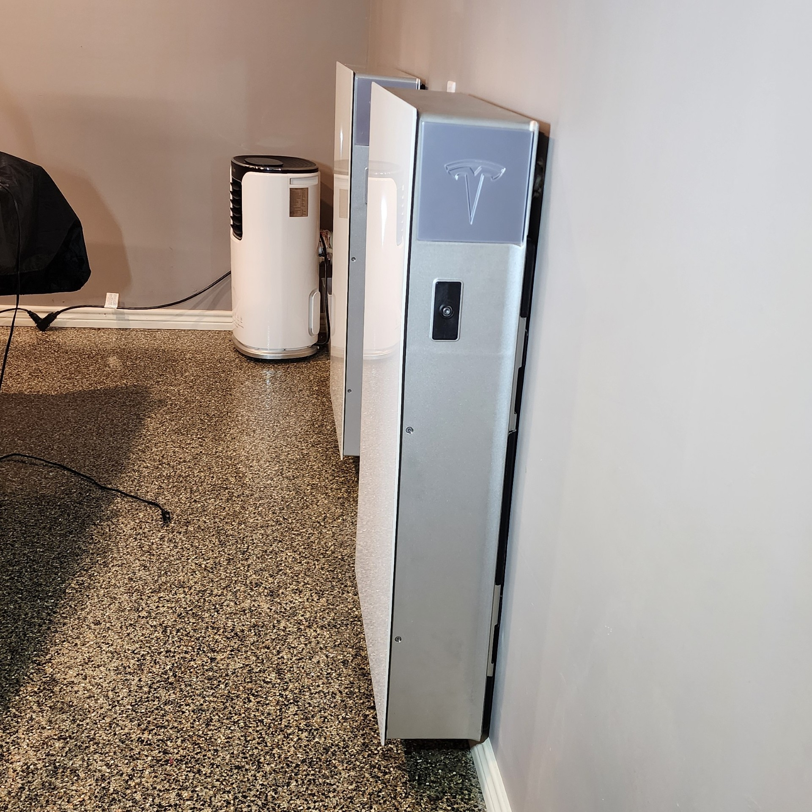
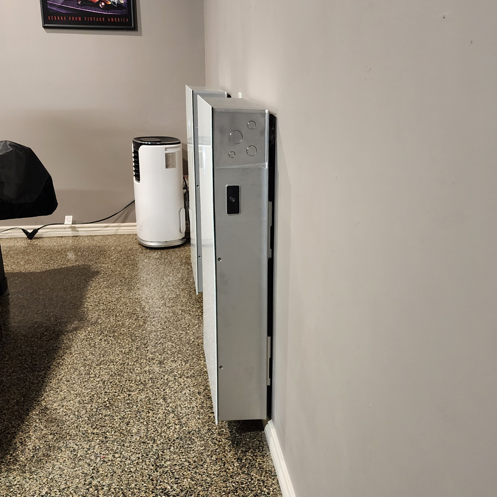
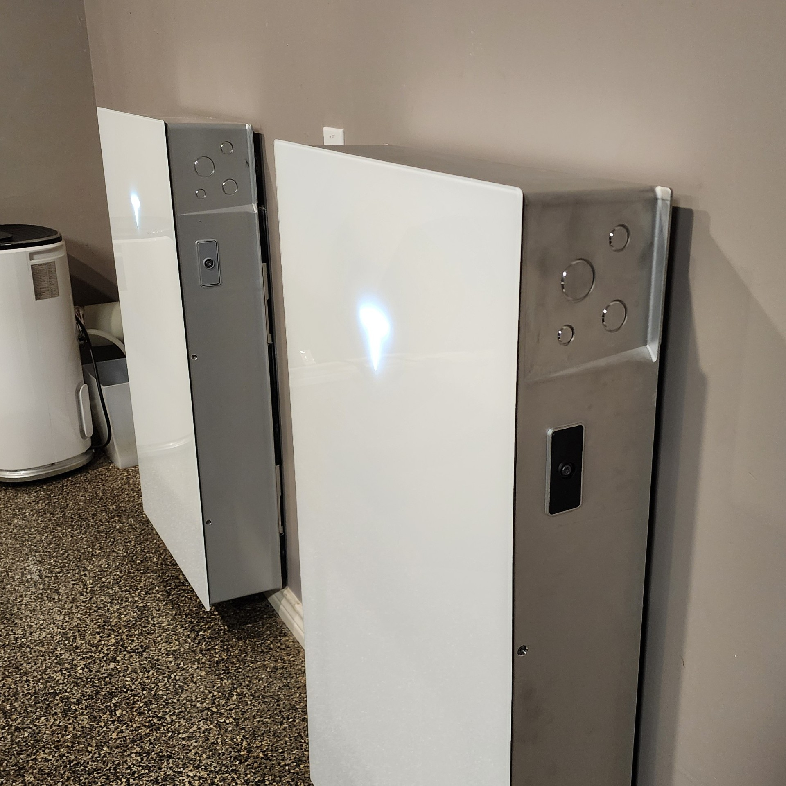

# Powerwall 3 Port Covers

**IMPORTANT:** Please be aware that these designs are licensed under [CC BY-NC-SA 4.0](https://creativecommons.org/licenses/by-nc-sa/4.0/). In short, you can print them and modify them freely for personal use. But if you want to use them commercially or sell them for profit, you'll need to contact me for a different license. Please give me credit when you can, and if you make significant changes please share those too.

## Background

I'm very happy to have such a clean install of my Powerwalls. I have no conduit running between the units or the ceiling. So it bothered me how unfinished the knock-out ports looked one each side of the units.

## Design

The Fusion 360 design file is [PortCovers.f3d](Design/PortCovers.f3d). It's fully parametric in case you want to modify something.

## Printing

Two ways to print:

1. [PortCovers.3mf](Print/PortCovers.3mf) - A Prusa Slicer project ready to print with recommended settings
2. [Left.stl](Print/Left.stl) and [Right.stl](Print/Right.stl) - Regular STL (see recommended settings below)

I printed with a layer height of 0.20mm and 15% infill. The prints pictured were printed with [SUNLU Silk Silver Filament](https://www.amazon.com/dp/B0B5ZLFTRN). If you use silk filaments, print the first layer very sloooowww to achieve the best possible "face".

## Install

